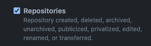

# branch-protection-service

Automatically protect default branches upon repository creation

## Infrastructure

The terraform config under `tf/` will set up an Azure function to host the branch protection service,
and sets up an organization webhook to notify the service when a new repo is created.

### Prerequisites
* An Azure subscription
* A service principal with Contributor access to the subscription
* A storage account with a container for state in the subscription
* A GitHub org
* An arbitrary shared secret

#### Secrets for workflow
The following secrets need to be configured for the terraform plan and apply workflows to work:
* Service principal secrets:
    * ARM_CLIENT_SECRET
    * ARM_CLIENT_ID
    * ARM_SUBSCRIPTION_ID
    * ARM_TENANT_ID
* GitHub PAT for creating webhook:
    * ORG_HOOK_PAT
        * (only needs `admin:org_hook` permission)
* Shared secret for webhook:
    * WEBHOOK_SECRET
        * (can be anything)

## Application

The branch protection service is implemented in Node.js and deployed as an Azure Function. 

### Usage

First, configure an organization webhook with the following settings:

- Content-Type: `application/json`
- Secret: a randomly generated value to protect the webhook, see the [GitHub documentation](https://docs.github.com/en/developers/webhooks-and-events/webhooks/securing-your-webhooks#setting-your-secret-token)
- Under events, select "Repositories":



Alternatively, the webhook can be configured with Terraform. Here's an [example](https://github.com/liatrio-tech-challenge/branch-protection-service/blob/main/tf/github.tf) of how to do that.

Next, configure an Azure app service plan and function. The function should include the following app settings:

| Environment Variable | Description                                                                                                                                                               |
|----------------------|---------------------------------------------------------------------------------------------------------------------------------------------------------------------------|
| `GITHUB_TOKEN`       | A GitHub [personal access token](https://docs.github.com/en/authentication/keeping-your-account-and-data-secure/creating-a-personal-access-token) with the `repo` scope.  |
| `WEBHOOK_SECRET`     | This should match the value configured on the organization webhook                                                                                                        |

In this deployment, we've configured the app service plan and function using [Terraform](https://github.com/liatrio-tech-challenge/branch-protection-service/blob/9f93c92e25fdfa56c873a520c293aae264d7ab90/tf/app_function.tf#L14-L40).

See the [infrastructure section](#infrastructure) for more details.

### Local Development

To work with it locally, you'll need the following tools installed:

- [Node.js](https://nodejs.org/)
- [Yarn](https://yarnpkg.com/)
- [Azure Functions Core Tools](https://docs.microsoft.com/en-us/azure/azure-functions/functions-run-local?tabs=v4%2Cmacos%2Ccsharp%2Cportal%2Cbash%2Ckeda#install-the-azure-functions-core-tools)

To run the application locally, do the following:

```shell
yarn install
GITHUB_TOKEN="ghp.." WEBHOOK_SECRET="top-secret" func start
```
